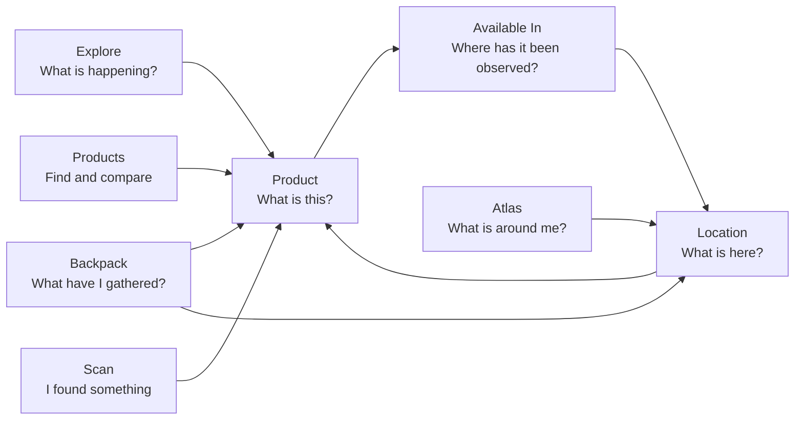
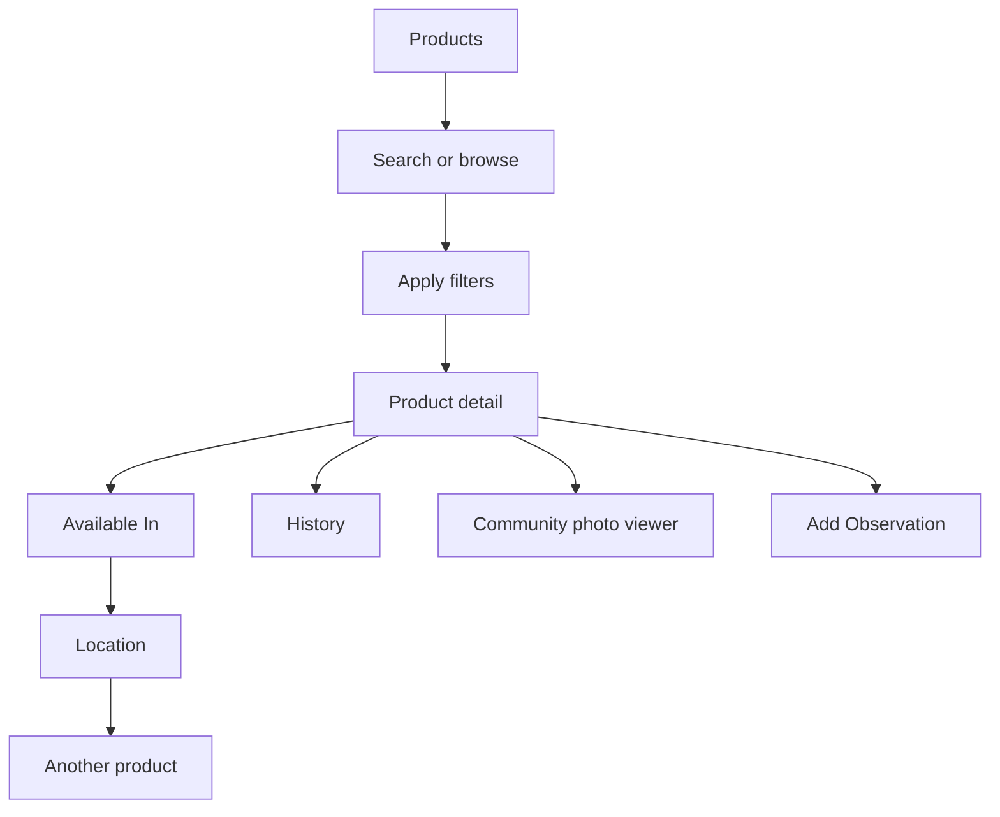
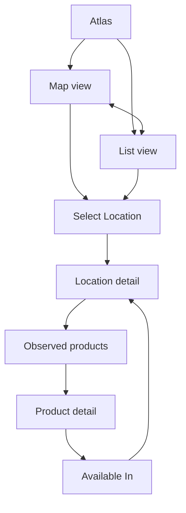
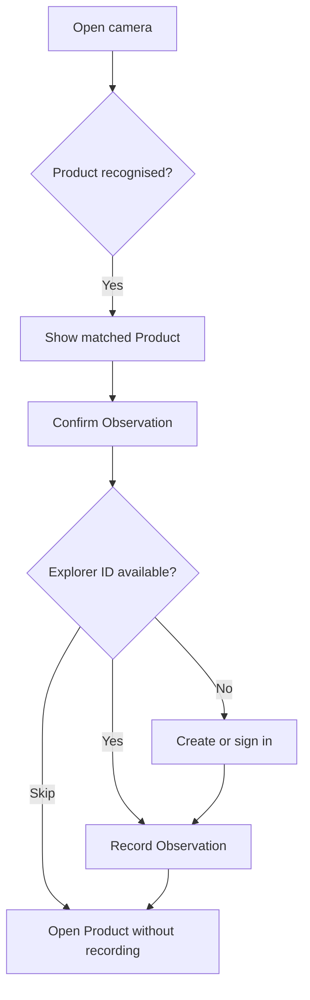
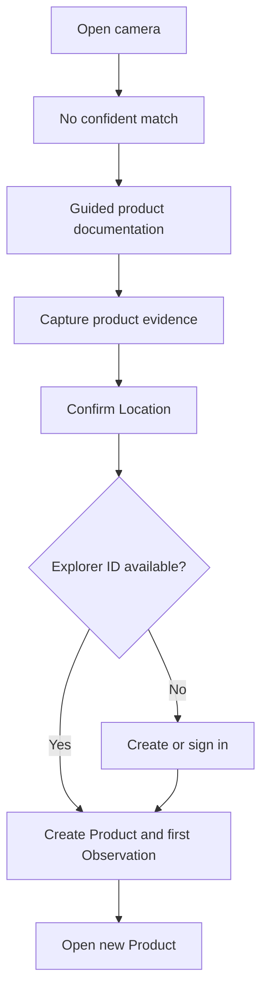
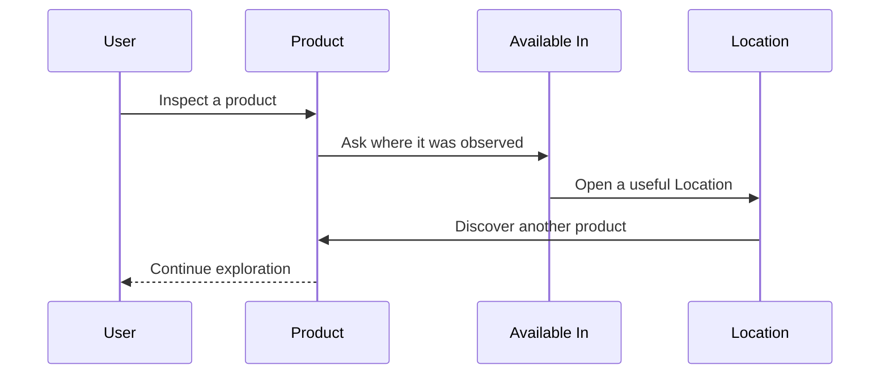

# UX-04 – Navigation and Interaction Architecture

**Status:** Design baseline  
**Owner:** Product Design  
**Applies to:** DiaperScout mobile application  
**Related:** UX-01 Experience Principles, UX-02 Onboarding, UX-03 Emotional Design

---

## 1. Purpose

The structure of an application shapes how people think about it. A confusing navigation model makes people remember menus, labels and routes. A good one lets them focus on the thing they came to do.

DiaperScout is intentionally organised around exploration rather than administration. It helps people discover absorbent products, understand what they are, see where they have been observed, and add useful evidence when they find something new. The application should feel like a field guide that becomes richer through careful community observation—not like a catalogue, retailer directory, or social network.

This document defines the navigation and interaction architecture that supports that experience. It explains the purpose of each primary destination, the questions each screen answers, how destinations relate, and the rules that govern future additions. It does not prescribe visual layout, component styling, or implementation detail. Those decisions belong in subsequent design and engineering work. UX-04 is the durable logic beneath them.

The navigation of DiaperScout is intentionally shallow. Users should spend their time exploring products and places, not navigating through layers of interface.

The document has four practical aims:

- give every primary destination a distinct and memorable purpose;
- make the principal product–place discovery loop easy to enter and easy to leave;
- protect browsing from unnecessary account gates while preserving accountable contribution; and
- provide a decision framework for future features, so growth reinforces the product rather than fragmenting it.

The desired outcome is not the smallest possible number of screens. It is a system in which every screen earns its existence by answering a genuinely different user question. Good navigation becomes almost invisible: people remember the discovery they made, not the route they took to make it.

---

## 2. The DiaperScout Mental Model

DiaperScout is not organised around its data model. It is organised around the questions people naturally ask while exploring. Products, retailers, locations, observations, photos and account records may all exist in the underlying system, but they must not dictate the experience. A person should not need to understand the database to understand the app.

Every primary destination exists to answer a fundamentally different question. If two destinations answer the same question, one of them probably should not exist.

| User question | Destination | The outcome it should create |
|---|---|---|
| “What is happening in this world?” | **Explore** | Curiosity and a useful next discovery |
| “What is this product?” | **Products** | Understanding of a product and its evidence |
| “What can I find around me?” | **Atlas** | A place to visit, or confidence about a place |
| “What have I gathered or started?” | **Backpack** | A coherent record of the user’s journey |
| “I found something.” | **Scan** | A fast, guided contribution workflow |

The Guide is the welcoming, human voice that introduces this world and supports its early moments. The Guide should never become a competing navigation destination or a generic assistant panel. Its role is to orient, reassure and help a person understand what DiaperScout is asking of them. Once a person is exploring, the architecture should be legible without requiring continual instruction.

### 2.1 A world of evidence, not claims

The app documents observations. An **Observation** is evidence that a particular product was encountered at a particular **Location**, at a particular point in time. It is not a promise of stock, a retailer claim, or a permanent availability statement. This distinction is central.

By presenting observed evidence rather than asserted inventory, DiaperScout can remain useful without claiming certainty it cannot maintain. A product’s presence at a Location says “someone found this here”; it does not say “this will be available when you arrive.” The interface should make this truthful model comprehensible through language, recency, and context rather than through alarming disclaimers.

The two primary exploration entities therefore complement each other:

- A **Product** answers: “What is this, and where has it been observed?”
- A **Location** answers: “What has been observed here?”

The result is a continuous loop rather than a hierarchy. From a product, a person can see Locations. From a Location, they can see products. Neither direction is subordinate; each is an equally valid starting point.

### 2.2 Exploration before administration

Many consumer applications make a profile, account dashboard, or settings screen the centre of the experience. DiaperScout should resist that pattern. Most value is available before a person has made any commitment: browsing products, exploring the Atlas, inspecting observations, and following recommendations should all work without an account.

An account exists to support contribution, continuity and stewardship—not to make exploration feel exclusive. The personal space is therefore called **Backpack**, and identity appears as an **Explorer ID**, not as a public-facing social profile. The language signals a practical, journey-oriented relationship with the app: these are the things a person carries, saves, returns to, and continues.

### 2.3 The architecture as a promise

The architecture makes several promises to users:

- The app will tell them where they are and what they can do next.
- A filter changes what they see, not where they are.
- A different view of the same material is not a different destination.
- They may investigate freely before being asked to sign in.
- A contribution will be structured enough to become useful community knowledge.
- They can move between a product and a place without getting trapped in a maze of intermediary pages.

Those promises are more valuable than any particular tab layout. They should survive changes in visual design, technology, or content volume.

---

## 3. Navigation Principles

The principles in this section are the constitution of DiaperScout’s interaction architecture. When a future decision is uncertain, choose the simplest approach that remains consistent with them.

### 3.1 Every screen answers a unique question

A screen is justified when a person has moved on to a different question—not merely because the product has another dataset to display. A Product detail and a Location detail have distinct purposes. A separate page for each filter value does not.

For example:

| Surface | Question | Why it is distinct |
|---|---|---|
| Product | “What is this?” | Explains the item and presents its evidence |
| Available In | “Where has this been found?” | Changes the task from understanding an item to finding a place |
| Location | “What can I find here?” | Reverses the discovery direction |
| History | “How has this product meaningfully changed?” | Presents a time-based narrative rather than current state |

This principle prevents screens that are technically tidy but experientially redundant. It also gives teams a useful test: state the user’s new question in one sentence. If it cannot be stated clearly, extend the current surface instead.

### 3.2 Filters are not destinations

Brands, categories, product types, retailer types, distance and similar criteria refine an existing exploration task. Selecting them must preserve the person’s context. A user remains in Products while filtering by brand; they remain in Atlas while filtering by retailer type.

Filters may use chips, a sheet, inline controls, search facets, or saved filter states. The control pattern may evolve, but the conceptual rule does not: applying a filter changes what the user is looking at, not where they are.

This avoids false depth, reduces backtracking, and makes it safe to experiment. A person can add or remove constraints without feeling that they have entered a separate part of the app.

### 3.3 Views are not separate screens

Map view and list view in Atlas are two representations of the same set of Locations. They share filters, query state, selection state where practical, and the same destination identity. Switching between them should feel like changing the lens, not travelling somewhere else.

The same principle applies to small changes in grouping, sorting and density. A layout change that preserves the underlying question belongs in the current destination. Do not create artificial routes simply because an implementation uses a different component.

### 3.4 Keep journeys shallow and reversible

The expected journey depth is one or two meaningful steps from a primary destination. People may move repeatedly between Product and Location, but they should not need to traverse a chain of category, retailer, region and branch pages to reach evidence.

Every detailed surface should provide an obvious return to its immediate context, preserve enough state to make that return useful, and offer a clear next step. Reversibility is especially important after viewing a photo, opening a map pin, applying filters, or pausing a Scan workflow.

### 3.5 Products and Locations are complementary

Product-first and place-first discovery are equally legitimate. A person may arrive with a specific product in mind, or may be standing near a particular shop and want to know what has been seen there. Neither path should be treated as secondary.

This is why **Available In** exists as a distinct product-adjacent screen and why a Location lists products directly. The app should repeatedly make the relationship visible without reducing either entity to metadata of the other.

### 3.6 Atlas documents places, not businesses

The Atlas is intentionally location-centric. A Location represents a specific place where observations have been made. Retailer and retailer type provide useful context, but they are not the primary navigation object.

This choice keeps DiaperScout focused on evidence rather than representation. A chain is not an abstract promise that every one of its branches has the same products; each Location has its own observation history, practical access information and surrounding context. Dedicated retailer hubs would invite unsupported generalisations, create duplicate navigation, and move the product away from the question people actually ask: “What can I find at this place?”

### 3.7 Structured community knowledge beats open discussion

DiaperScout gains credibility when contributions are searchable, comparable, time-aware and possible to moderate. The default community unit is therefore an Observation, not a free-form comment. Photos, notes and product details may support an Observation where appropriate, but they should be collected in a structured workflow.

Open comment systems are deliberately not part of the foundational architecture. They can become difficult to search, hard to moderate and less useful to someone making a practical decision. If conversational features are explored in the future, they must have a clear job that structured evidence cannot do and must not displace the evidence model.

### 3.8 Accounts enable contribution, not exploration

Anonymous users can browse. Sign-in should occur only at the moment it is needed to preserve attribution, drafts, saved work or contribution quality. A late, explainable gate is kinder than an early, generic one.

When an anonymous person reaches confirmation in Scan, the app should explain the benefit: an Explorer ID allows the Observation to be credited and maintained. The person must also retain a dignified escape route—such as continuing to the Product without recording an Observation. Browsing should never be held hostage to account creation.

### 3.9 Scan is an action, not a place

Unlike the other primary destinations, Scan is not somewhere a person goes. It is something they do. Selecting Scan opens the camera immediately and begins a workflow. There is no landing screen explaining what scanning is, no collection of scan-related content, and no tab-local feed.

This distinction gives Scan its speed and clarity. It is a contribution instrument placed directly in the navigation because it grows the shared world.

### 3.10 Evidence should be legible, not overstated

The interface must make recency, source and scope understandable. “Observed at” language, dates and Location names are more truthful than unqualified “available” claims. The architecture should avoid stock-like promises and any interaction that implies real-time inventory unless that data is genuinely available and clearly differentiated.

---

## 4. Primary Navigation

DiaperScout has five primary destinations: Explore, Products, Atlas, Backpack and Scan. Their labels should remain stable because each carries a distinct mental model. The navigation chrome may adapt to platform conventions and screen size, but it must not obscure those five jobs.

The diagram describes relationships, not a required route hierarchy. Product and Location are the principal connective tissue. Explore provides editorial entry points; Products and Atlas provide deliberate search and browse entry points; Backpack provides personal continuity; Scan creates new evidence.

### 4.1 Destination responsibilities

| Destination | Primary responsibility | It is not |
|---|---|---|
| Explore | Make the living world feel discoverable | A generic dashboard or account homepage |
| Products | Browse, search and understand products | A retailer catalogue |
| Atlas | Explore observed Locations nearby or by area | A chain-directory or stock promise |
| Backpack | Return to saved, drafted and personal work | A social profile or settings hub |
| Scan | Start a focused contribution workflow | A camera gallery or content destination |

The tab bar, or equivalent primary navigation, should give equal visual weight to the destinations while recognising Scan’s action-oriented role. It must be possible to understand each label without onboarding, yet The Guide may explain their purpose during first use.

---

## 5. Explore

### 5.1 Purpose

Explore is DiaperScout’s living front page. Its job is not to summarise every feature or force a user through a dashboard checklist. It should make the product feel active, local, and worth returning to by surfacing discoveries that lead naturally into Products and Atlas.

Explore answers “What is happening in this world?” It invites curiosity before it demands intent. A person who has no product name, no selected Location and no immediate task should still find a meaningful way in.

### 5.2 Content model

Explore is one continuous, scrollable experience. It may include a balanced selection of:

- recently added or recently observed products;
- notable community Observations;
- nearby activity when permission and context support it;
- newly documented Locations;
- seasonal, editorial or featured discoveries; and
- gentle invitations to save, inspect, or explore further.

These modules are not independent screens. They are editorial windows into the same underlying product–place graph. A card must lead somewhere purposeful: typically a Product, Location, observation-supported detail, or relevant Atlas state. Avoid cards that lead only to another feed.

### 5.3 Behaviour and rhythm

Explore should reward short visits and support long browsing sessions. Content ought to be understandable in isolation; a person returning after a week should not need to reconstruct a previous sequence. At the same time, the feed should not feel random. Recency, relevance, nearby context and diversity should be balanced so that repeated use reveals a living system rather than an endlessly shuffled catalogue.

The interface should avoid turning Explore into a notification centre. Important personal tasks belong in Backpack, while actionable discovery belongs in Explore. This separation prevents the front page from becoming administrative and keeps its emotional role intact.

### 5.4 Why this approach

Starting with discovery lowers the threshold for a new user. A catalogue asks users to know what they want; an Atlas asks them to choose an area; a personal space asks them to have history. Explore can offer value before any of those conditions exists.

It also gives community contribution visible meaning. Observations do not vanish into a database: appropriately selected evidence helps other people decide what to investigate. The feed must still respect the product’s evidence-first posture—editorial presentation should never convert an Observation into a claim of guaranteed availability.

### 5.5 Explore rules

- Keep the feed continuous; do not split it into a maze of content channels.
- Every item needs a clear underlying destination and an understandable reason for appearing.
- Use product and Location terminology consistently; never relabel a Location as a “store” merely for variety.
- Nearby content requires a clear permission-aware fallback when location access is unavailable.
- A person may browse Explore anonymously and should not meet an account gate merely by opening a detail.

---

## 6. Products

### 6.1 Purpose

Products is the deliberate product-first exploration destination. It serves people who know a name, brand, category or characteristic they want to investigate, as well as people who simply want to browse the catalogue. Its central question is: “What is this product?”

Products should make the item intelligible before asking the person to think about retailers or Locations. The product is the stable object of interest; observations and places provide evidence around it.

### 6.2 Products landing and results

The Products landing surface contains search, category and brand affordances, and a browsable product listing. Search should be prominent because the user may arrive with packaging, a name, or a partial recollection. Browsing must remain viable when they do not.

Categories, brands and product types are filters, not permanent destinations. A filter state can be shareable or restorable where valuable, but it remains recognisably Products. A person should be able to understand what constraints are active, remove them individually, and return to a broad list without navigating backwards through a taxonomy.

Product cards should provide enough information to support scanning and comparison while leaving the Product detail to do the explanatory work. The card is an invitation, not a compressed page.

### 6.3 Product detail

The Product detail answers “What is this?” It is the canonical place for product information, a summary of community evidence, pathways to related Locations, meaningful history, community photos, and the option to add an Observation.

The detail should distinguish clearly between stable product information and time-sensitive evidence. Product identity, packaging details and categorisation may be comparatively stable. Observation counts, latest sightings and Locations are evidence whose meaning depends on time and context. Do not flatten these into one undifferentiated facts list.

The Product detail should make the next relevant question visible rather than forcing an arbitrary reading order. For someone trying to obtain the item, **Available In** is the natural next step. For someone holding the item in their hand, **Add Observation** is the natural next step. For someone trying to assess change, **History** is the natural next step.

### 6.4 Available In

Available In is a dedicated screen because it changes the task. The user is no longer learning about a product; they are locating evidence of it in the real world. It presents the Locations where the product has been observed, with recency and sufficient context to judge usefulness.

Available In may support list and map representations, but its destination remains product-scoped. A Location opened here should retain the ability to return to this product-specific context. This matters when a person is comparing several places for one item.

The phrase “Available In” is a familiar, readable label, but the surrounding content must preserve the evidence model. Use observation dates and “observed at” language where appropriate. Never imply that a Location is certain to have present stock solely because it appears in this list.

### 6.5 History

History tells the humanly meaningful story of a Product over time: notable product changes, significant documentation milestones, and carefully selected observation-related events. It is not a technical audit log. Database updates, minor edits and internal status changes do not belong here unless they alter what a user needs to understand.

History earns a separate screen because time is the organising principle, not because it is a hidden subsection. The screen should answer “How has this product meaningfully changed?” and make chronology legible without overwhelming a person with system activity.

### 6.6 Community photos

Photos add practical recognition value. They can help someone identify packaging, distinguish variants, or understand how a product appears in the wild. However, a photo viewer does not answer a different navigation question. It opens in a full-screen viewer or equivalent focused presentation and returns the person to the context from which it was launched.

This preserves a clean distinction: photo viewing is a mode, not a destination. The viewer should include accessible close behaviour, predictable gesture handling, and a clear route back to the supporting Product or Observation context.

### 6.7 Product flows

The loop between Product and Location is intentional. It lets a person move from an item to the evidence supporting it, then to the broader context of a place, then to another discovery without resetting their exploration.

### 6.8 Product rules

- Brands, categories and product types filter Products; they do not create destination pages by default.
- The Product is not owned by a retailer. Retailer information may contextualise observations but must not replace product identity.
- Observation summaries should favour useful recency and context over raw counts alone.
- “Available In” expresses observed presence, not promised inventory.
- Community photos remain attributable to their supporting context and open in a focused viewer.
- A product can be browsed without an Explorer ID; contribution prompts appear only when a person initiates a contribution.

---

## 7. Atlas

### 7.1 Purpose

Atlas is the place-first exploration destination. It helps a person answer “What can I find around me?” or “What has been observed in this area?” It is a map of documented places, not a retailer directory and not an inventory service.

The name Atlas should evoke orientation and discovery. The surface should support both an immediate nearby need and the slower pleasure of exploring an unfamiliar area. It must remain useful whether the person grants location permission, searches an area manually, or arrives through a product’s Available In list.

### 7.2 Map and list are one Atlas

Atlas offers Map View and List View. They show the same underlying Locations and the same current filters; they differ only in how a person interprets spatial information. Map View is best for orientation, proximity and surrounding context. List View is best for scanning, comparing distance, and using assistive technologies or constrained screens.

The switch must preserve the user’s task. If a person filters to a retailer type, searches a place, or narrows a region in one view, moving to the other should keep that state whenever technically reasonable. Resetting the search on a view change makes the two representations feel like separate products and violates the mental model.

### 7.3 Location detail

A **Location** is a specific physical place where products have been observed. It may display address and access information, opening-hours information sourced externally where available, directions, retailer context, recently observed products, and the wider set of products documented there.

The Location detail answers “What can I find here?” Its content should make it possible to act: decide whether to visit, navigate there, inspect evidence, or add an Observation. The direction action should hand off cleanly to the device’s preferred mapping capability without making DiaperScout pretend to be a turn-by-turn navigation app.

Opening hours are supporting context, not proof of product availability. They should identify their external source and may require graceful states for missing, uncertain or stale data. Never let an externally sourced amenity field dominate evidence from community Observations.

### 7.4 Retailers as context

Retailer name, brand and type can help users recognise a Location and apply useful filters. They should appear as contextual metadata. There is no default retailer detail route because that would answer a weaker, more abstract question than the app is designed around.

This does not prevent future retailer-level aggregation if there is a demonstrated need. It means any such aggregation must be introduced carefully as a lens over Locations, not as a replacement hierarchy. The individual Location remains where the evidence lives.

### 7.5 Atlas flows

This flow intentionally permits a circular journey. A person might begin with a nearby Location, discover a Product, compare other observed Locations, and return to their starting point. The interface should make such movement feel like exploration, not repeated back-button work.

### 7.6 Atlas rules

- Atlas represents Locations. It does not make global claims about retailers or chains.
- Map and List are views of the same destination and preserve state where possible.
- Distance ordering and nearby presentation require transparent fallbacks when user location is unavailable.
- Filters, such as retailer type, act in place.
- Each Location must use the capitalised term **Location** in user-facing and internal design language; avoid interchangeable “store”, “branch” and “shop” labels unless quoting an address or real-world name.
- Products shown at a Location are observed evidence and should include recency where it informs the decision.

---

## 8. Backpack and Explorer ID

### 8.1 Purpose

Backpack represents the user’s journey through DiaperScout. It is a collection of discoveries, saved places, unfinished work and personal progress—not a conventional profile page.

The backpack metaphor is practical and warm. It suggests equipment carried through an exploration: things worth keeping close, work to continue, and evidence gathered over time. This framing makes personal information useful without encouraging performative social behaviour.

### 8.2 Explorer ID

At the top of Backpack, the user’s identity is represented through an **Explorer ID**. The Explorer ID may include a name, Explorer and Helper status, member-since information, discovery and Observation counts, and other lightweight signals of participation. It should feel like an ID holder attached to the Backpack, not a public social profile.

The Explorer ID is intentionally compact. It provides continuity and attribution but does not become a destination for followers, posts, public timelines or social comparison. If profile editing exists, it should be reached as a focused secondary task, returning cleanly to Backpack.

### 8.3 Backpack contents

Backpack may contain the following sections:

- **Continue Journey** — saved drafts and incomplete contribution work;
- **Saved Products** — products a person wants to revisit;
- **Saved Locations** — places a person wants to remember or visit;
- **Collections** — purposeful groupings of saved discoveries;
- **My Discoveries** — the person’s credited contribution history and related evidence; and
- **Settings** — account and application controls, visually and conceptually secondary.

These are personal lenses over existing entities. A saved Product still opens the canonical Product detail; a saved Location still opens the canonical Location detail. Backpack should not fork the content model into “personal versions” of the same pages.

### 8.4 Drafts and continuity

Drafts deserve particular care. Creating an Observation, documenting an unknown product, or attaching information may take place in a physically awkward context: a shop aisle, a poor connection, a hurried moment. Continue Journey should make unfinished work easy to understand and resume without shame or ambiguity.

An anonymous user may be allowed to begin a workflow before they create an Explorer ID, but any persistence behaviour must be clear. If a draft can only survive account creation or device storage, say so at the appropriate moment. Do not promise seamless continuity that the system cannot provide.

### 8.5 Why Backpack is not a profile

A traditional profile centre answers “Who am I to other people?” That is not the primary value proposition of DiaperScout. Backpack answers “What am I carrying through this journey?” It gives people a reason to return without putting them on display.

This is an important product boundary. It keeps the app focused on products, Locations and evidence, while still rewarding care and contribution. Recognition can exist through Explorer ID and Helper status without requiring a social graph.

### 8.6 Backpack rules

- Use **Explorer ID**, not “profile”, as the primary identity term.
- Explorer ID is integrated into Backpack, not a standalone primary destination.
- Saved items link to canonical Product and Location details.
- Drafts are actionable work, not just historical records.
- Settings remain secondary and should not dominate the first impression of Backpack.
- Privacy controls must be understandable, especially where contribution history is visible to others.

---

## 9. Scan and Contribution Workflows

### 9.1 Purpose

Scan turns a moment of discovery into structured community knowledge. It is deliberately direct: selecting Scan opens the camera immediately. The app should not insert an explanatory landing screen between intention and action.

The Scan workflow must be optimistic without overpromising recognition. Whether a product is recognised or not, the person should understand what DiaperScout found, what it needs from them, and what happens next. The goal is not merely to classify an image; it is to create or strengthen an Observation tied to a real Location.

### 9.2 Recognised product flow

When Scan recognises an existing Product, the system presents that candidate clearly and asks the person to confirm the Observation. Confirmation should include the necessary place and evidence context without exposing unnecessary form complexity.

The confirmation step must feel like validation, not data entry for its own sake. It can ask the person to verify the Product and Location, optionally add useful evidence, and then explain the effect of recording the Observation. The final confirmation should use precise language: the person is recording an Observation, not asserting that the product is universally in stock.

### 9.3 Anonymous users

Anonymous people may browse the app and begin a Scan journey. When they attempt to record an Observation, the app asks them to sign in or create an Explorer ID because attribution and contribution stewardship require an accountable identity.

This is a contribution gate, not an exploration gate. The prompt should make the value clear and offer an alternative: **Skip** continues to the recognised Product page without recording the Observation. The person should never be punished for declining account creation, nor should the app silently discard a contribution attempt without explanation.

### 9.4 Unknown product flow

If a product is not recognised, Scan becomes a guided documentation workflow. The first contributor creates the product record and its first Observation as one coherent act. The experience should collect only what is needed to make the new record meaningful and should use progressive disclosure to avoid intimidating forms.

Guidance should make a difficult task feel possible. The Guide may help explain why certain details matter, how to frame a photo, or what distinguishes one variant from another. The Guide supports the workflow; it does not replace the user’s agency or disguise uncertainty.

### 9.5 Error, uncertainty and cancellation

Camera permissions, weak connectivity, poor images and uncertain matches are normal conditions, not exceptional failures. The workflow must explain them plainly and preserve useful work when possible. A person should be able to retake an image, choose another candidate, save or resume a draft where supported, or exit without losing confidence in the app.

If recognition confidence is low, present uncertainty honestly rather than claiming a definitive match. It is better to ask for confirmation or route to guided documentation than to create an incorrect Observation. The product’s trust model depends on this restraint.

### 9.6 Scan rules

- Scan opens the camera immediately.
- Recognition is a suggestion until the user confirms it.
- An existing Product flow ends in a confirmed Observation or a graceful Product view.
- An unknown product flow creates both the Product record and its first Observation.
- Explorer ID is required to submit a contribution, not to browse or inspect the result.
- “Observation” is the canonical term; avoid “report”, “submission” or “sighting” as competing labels.
- The app must communicate uncertainty and preserve user agency at each branch.

---

## 10. Cross-Destination Interaction Rules

The following rules apply across the application. They should be treated as behavioural requirements during design and implementation.

### 10.1 State is part of navigation

Navigation is not only a route change. It includes the search, filters, selected map area, scroll position and originating context that make a route meaningful. When returning from a Product to Products, from a Location to Available In, or from a photo viewer to a detail page, preserve state whenever it supports the user’s task.

State preservation should be purposeful, not absolute. A stale map region after a significant context change may be misleading; an active product filter on a simple back navigation is helpful. Teams should ask whether preservation helps a person continue their thought.

### 10.2 Sheets, viewers and modals are modes

A filter sheet, photo viewer, permission prompt, confirmation panel or other focused overlay must behave as a temporary mode. It must have clear dismissal, respect platform back behaviour, restore the underlying context, and avoid trapping screen-reader or keyboard focus. These overlays do not create new architectural destinations.

### 10.3 Language carries the model

Use terms consistently:

| Preferred term | Meaning | Avoid as a default substitute |
|---|---|---|
| **The Guide** | The welcoming, supportive in-app voice | assistant, bot, coach |
| **Explorer ID** | The user’s lightweight identity and attribution | profile, account card |
| **Location** | A specific physical place with observations | store, branch, shop |
| **Observation** | Community evidence of a Product at a Location | report, submission, stock update |

Plain-language exceptions are acceptable where they improve comprehension, but they must not fracture the product model. Consistent naming helps a new contributor, designer or user understand that the same things are being discussed everywhere.

### 10.4 Permission requests are contextual

Ask for device permissions only when their benefit is immediately apparent. Camera permission belongs in Scan; location permission belongs when nearby Atlas or location-aware content is first used. Explain what will improve and offer a useful manual fallback where feasible.

Permission denial should not produce a dead end. Atlas can support search and manual area selection. Scan can explain how to enable camera access, and may offer a non-camera documentation route if one exists. The interaction architecture must remain respectful of refusal.

### 10.5 Empty states are invitations, not failures

An empty result, an unobserved Location, or a new user’s Backpack should explain the current state and propose an appropriate next action. It must not make the world appear broken. For example, no observations at a Location can invite a contribution through Scan; no saved items can invite exploration through Products or Atlas.

Avoid generic “nothing here” language when the empty state can reinforce the app’s core loop. However, do not pressure people to contribute. The invitation should be informative and optional.

### 10.6 Accessibility and clarity

The map can never be the only way to access Atlas content. List equivalents, readable labels, clear focus order and non-gesture-only controls are requirements, not enhancements. Photos require useful descriptions or contextual labelling; status changes in Scan must be announced; colour cannot be the only indicator of evidence recency or selected state.

Interaction feedback should be timely and proportionate. Recording an Observation needs a clear success state and an understandable next destination. Applying a filter needs a visible result change. Failed network work needs a recoverable explanation. These details make the architecture trustworthy in use.

---

## 11. Navigation Relationships and Journey Patterns

The product’s strongest journeys are loops, not funnels. A person can begin with whichever information they possess and move naturally toward the next question.

### 11.1 Product-to-place discovery

This is the canonical evidence loop. It should require no account and no conceptual reset. The user moves from an object, to grounded evidence, to a real-world place, to further objects.

### 11.2 Place-to-product discovery

A person may begin in Atlas because they are nearby, travelling, or choosing where to visit. They select a Location, inspect its observed products, open an interesting Product, and possibly compare its other observed Locations. This direction is equally important because it turns the app into an exploratory companion rather than a list lookup tool.

### 11.3 Discovery-to-contribution

Explore can surface an interesting Product or Location, which may prompt a person to add their own evidence later. Scan is then available as a fast action. After confirmation, the app opens the Product because the newly recorded Observation belongs to that product’s ongoing story. It should also offer a clear way to see the Location context when that is the more useful next step.

### 11.4 Return and continuity

Backpack lets people return to saved discoveries and incomplete work. This is a continuity loop, not a separate content ecosystem. A saved Location returns to the same Location detail other users see; a draft returns to the same contribution workflow; an Explorer’s record points back to the evidence they helped create.

---

## 12. Future Expansion Guidance

DiaperScout will grow. The purpose of UX-04 is not to freeze the product; it is to make growth coherent. New information does not automatically justify a new screen. Before adding a route, tab or primary destination, test it against the following questions:

1. What distinct user question does it answer?
2. Can that question be answered by a section, filter, view, sheet or state of an existing destination instead?
3. Does it strengthen the Product–Location evidence loop, personal continuity, or contribution workflow?
4. Can a person enter and leave it without increasing navigation depth or losing context?
5. Does it preserve the distinction between observed evidence and asserted availability?
6. Does it introduce an account gate, and if so, is that gate genuinely required for the action?

### 12.1 Appropriate forms of expansion

Future development will often fit naturally into existing destinations:

- new product attributes usually belong on Product detail or as Products filters;
- new spatial lenses usually belong in Atlas as map/list state or filters;
- new types of saved work belong in Backpack;
- new evidence capture methods belong within Scan or an Observation workflow; and
- editorial curation belongs in Explore when it gives a person a meaningful discovery path.

This approach prevents the primary navigation from expanding every time the data model becomes richer.

### 12.2 Caution around retailer and social expansion

Retailer-level pages, stock alerts, reviews, feeds of personal activity and follower mechanics may appear tempting as the app matures. Each creates a risk: retailer pages can obscure Location-specific evidence; stock claims can overstate certainty; social features can shift the incentive from useful documentation to attention-seeking.

None is categorically impossible. But each needs a demonstrated user question, an evidence-aware model, a moderation and privacy plan, and a reason it cannot be satisfied through the existing architecture. The default should be restraint.

### 12.3 New primary destinations are exceptional

A new primary destination should be added only when it represents a durable, frequently accessed job that cannot be expressed through Explore, Products, Atlas, Backpack or Scan. It must have a label that a new user understands, a distinctive mental model, and clear relationships to Product, Location and Observation.

Adding a tab is not a solution to discoverability by itself. Often the better answer is a more visible entry point from Explore, a contextual action in a detail view, or a better-organised Backpack section.

---

## 13. Reference Inventory

This inventory is a reference for planning and implementation. It is not a reason to create unnecessary routes; some entries are modes or focused workflows rather than standalone destinations.

| Area | Primary surface | Supporting screens, views or workflows |
|---|---|---|
| Explore | Explore feed | Contextual entry points to Product, Location and Atlas |
| Products | Products landing/results | Product detail, Available In, History, community photo viewer, add Observation |
| Atlas | Atlas | Map View, List View, Location detail, directions hand-off |
| Backpack | Backpack | Explorer ID, Continue Journey, saved items, Collections, My Discoveries, Settings |
| Scan | Camera action | recognition, confirmation, sign-in/create Explorer ID gate, guided new Product workflow |

The deliberately lean inventory is a strength. It reduces maintenance burden, lowers cognitive load and creates a more teachable product. The Guide, onboarding and visual design should make this small set of concepts feel welcoming rather than sparse.

---

## 14. Closing Principle

UX-04 defines the rules of DiaperScout’s world. The Guide welcomes people into it. Explore sparks curiosity. Products document things. Atlas documents places. Backpack documents a person’s journey. Scan grows the shared map of evidence.

As DiaperScout grows, new features should reinforce this architecture rather than compete with it. The objective is not to minimise the number of screens; it is to ensure that every screen has a clear purpose and answers a unique question.

Good navigation becomes almost invisible. Users should remember the discoveries they made, not the path they took to find them.
