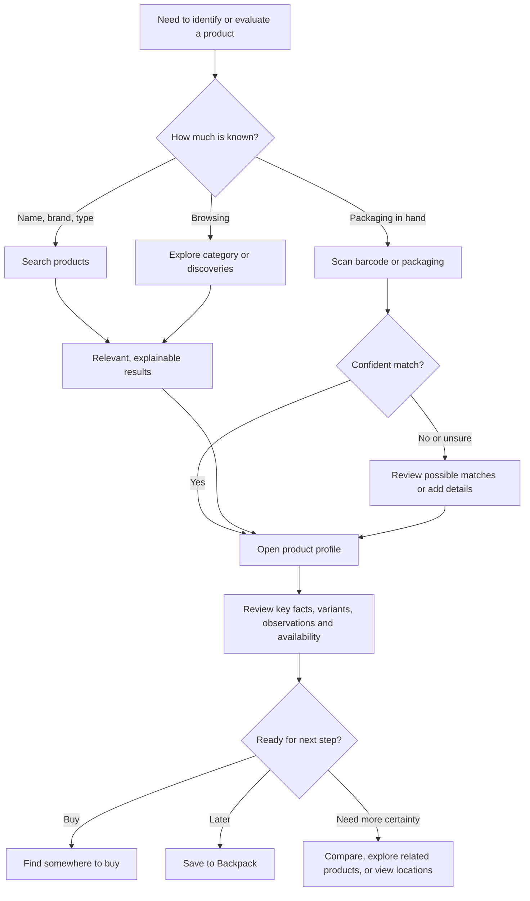
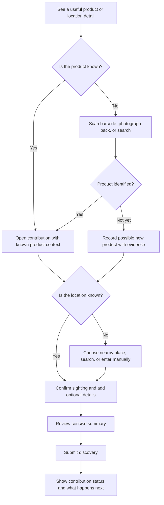
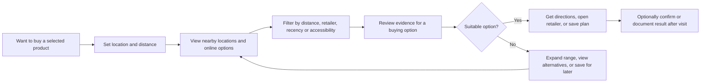
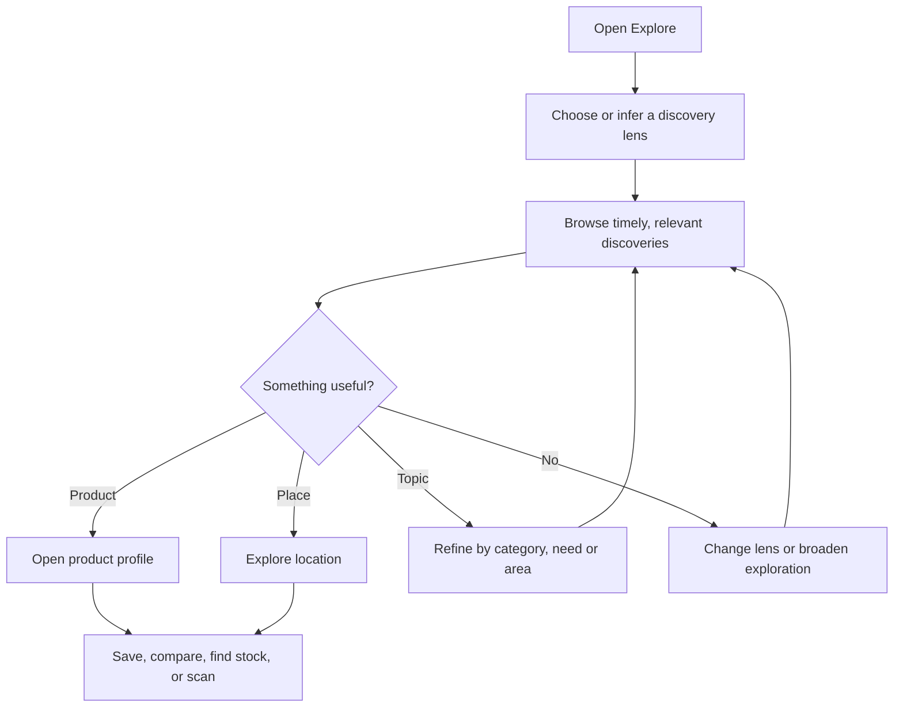
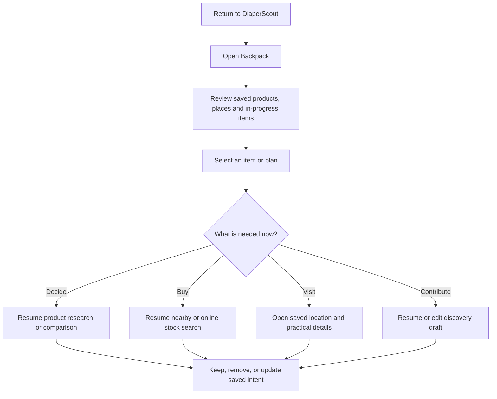
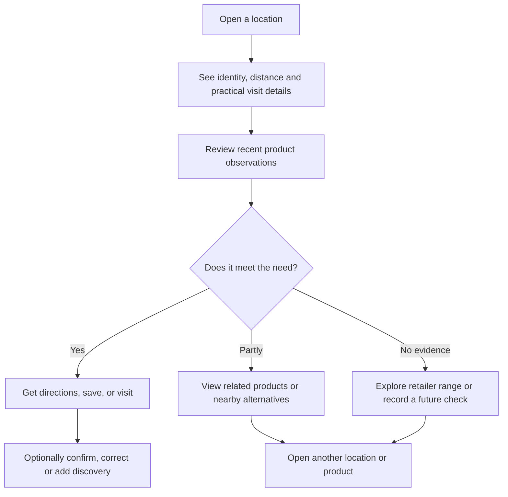
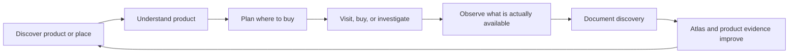

# UX-05 — User Journeys

**Status:** Draft v1.0

## Purpose

DiaperScout helps people find, understand, buy, and share information about reusable and disposable nappy products in the real world. Its value does not come from a single screen or a single successful search. It comes from helping a person move naturally from a question — *What is this? Where can I get it? Will it work for me?* — to an informed next step.

This document defines the primary user journeys that shape that experience. It describes the reasons people arrive, the paths they may take, the moments at which confidence can be gained or lost, and the outcomes that tell us the product has been useful. It is not a sitemap, a list of features, or a specification for individual screens. Those artefacts follow from the journeys described here. Together with UX-04, it forms the behavioural blueprint of DiaperScout.

The journeys are intentionally connected. Someone may start by exploring recent discoveries, open a product, look for a nearby stockist, save it to their Backpack, scan it in a shop later, and add an observation. Treating these as one continuous experience is essential. DiaperScout should feel like a trusted field guide: useful when planning at home, useful in the aisle, and increasingly useful as the community contributes what it finds.

The intended audiences for this document are product, design, research, content, engineering, and community teams. It provides a shared basis for prioritising work and evaluating whether a proposed interaction supports a real user intention.

## Journey Philosophy

### Begin with intent, not navigation

People do not wake up wanting to use an “Atlas” or a “Backpack”. They want to identify a product, compare an option, find a place to buy it, remember something for later, or record a useful discovery. Primary destinations give these intentions a stable home, but the interface should always speak to the task at hand. Clear action labels, descriptive results, and useful context matter more than requiring people to learn an internal product vocabulary.

### Support exploration and action equally

DiaperScout is both a research tool and a practical companion. A person may browse calmly before a baby arrives, or need an answer in seconds while standing in a shop. Every journey should therefore offer an easy route into exploration while preserving a quick, confident route to action. Search, scanning, map-based discovery, and saved items should work together rather than compete for attention.

### Build confidence through evidence

Product information can be incomplete, regional, and changeable. Availability varies by retailer; pack designs change; an observation may be accurate but no longer current. DiaperScout should distinguish verified product facts from community observations, show when information was last updated, and make uncertainty legible without making the interface feel hesitant. Where the answer is not known, the product should suggest the most useful next action: check a nearby location, scan the packaging, save the item, or contribute what was found.

### Make contribution lightweight and worthwhile

Every contribution strengthens future journeys. Yet people should never need to become data curators before they can help. A contribution can begin with a barcode scan, a photo, a retailer selection, or a simple confirmation that an item was seen. The flow should preserve context already known by the product, ask only for information that improves the record, and show the contributor how their observation will help others.

### Preserve continuity without demanding commitment

Backpack is the mechanism that lets an exploratory session continue across time. It should be useful to a first-time visitor as well as to a returning explorer. Saving an item must never interrupt a decision; it should quietly capture intent and make the next visit more purposeful. An Explorer ID, if needed to preserve contributions or content across devices, belongs after a person sees the value of saving or contributing, not before they can begin exploring.

### Design for the physical world

Many journeys cross boundaries between home, a shop, a changing bag, and a phone held in one hand. Information should be scanable, controls comfortably touchable, and important details resilient to poor connectivity or limited time. Location and camera permissions must be requested in context, with an understandable benefit and a graceful manual alternative.

## Journey Overview

The six core journeys describe the primary reasons people open DiaperScout. They are deliberately not a linear funnel. Each has a clear starting intention and a successful immediate outcome, but each can also lead naturally into another journey.

```mermaid
flowchart LR
    E["🌿 Explore"]
    P["📦 Products"]
    A["🗺️ Atlas"]
    B["🎒 Backpack"]
    S["📷 Scan"]

    J1["Find a Product"]
    J2["Document a Discovery"]
    J3["Find Somewhere to Buy"]
    J4["Explore Discoveries"]
    J5["Continue My Journey"]
    J6["Explore a Location"]

    J4 --> E
    E --> J1
    J1 --> P
    P --> J3
    J3 --> A
    A --> J6
    J6 --> P
    P --> S
    S --> J2
    J2 --> P
    P --> B
    A --> B
    B --> J5
    J5 --> P
```

The diagram intentionally avoids individual screens. It shows how intentions move between DiaperScout’s primary destinations. The design should make these hand-offs feel like sensible next steps, never like detours through an application architecture.

| Journey | Primary intention | Typical outcome |
| --- | --- | --- |
| Find a Product | Identify, understand, or compare an item | Confident product decision or saved candidate |
| Document a Discovery | Capture something seen in the world | Useful observation submitted with minimal effort |
| Find Somewhere to Buy a Product | Turn a product decision into a purchase plan | Relevant nearby or online buying option |
| Explore Discoveries | Browse what the community has found | A useful lead, product, or location to investigate |
| Continue My Journey | Return to unfinished or saved intent | A resumed task with no need to reconstruct context |
| Explore a Location | Understand what a particular place offers | Confidence that a visit is worthwhile |

## Core Journey 1 — Find a Product

### User need and motivation

The person is trying to make sense of an absorbent product. They may know a brand, a product type, a feature, a size, or only what the pack looked like. They may be preparing for a new baby, responding to a leak or fit problem, comparing sustainable choices, or simply trying to identify an item encountered elsewhere. Their underlying need is not a catalogue entry. It is confidence in whether this is the right product to consider next.

This journey must support both directed search and open-ended discovery. A known-item search should produce a direct answer quickly. A vague search should help the person narrow the field without exposing them to a wall of interchangeable results.

### Entry points

- Search from Explore or Products.
- A barcode or image result from Scan.
- A product card in a discovery, location, or Backpack.
- A shared product link.
- A product suggested after viewing a similar item or category.

### Journey

### Experience requirements

Search should tolerate natural language, partial names, common misspellings, and meaningful product attributes. Results should establish relevance before asking people to open several pages: brand, product family, format, size or variant, a useful image, and a short differentiator are more valuable than a generic title. Filters should reduce effort rather than create a second research task; retain them visibly and make removal easy.

The product profile is the decision centre of the journey. It should lead with the information a person can use immediately: what the product is, what variant is being viewed, who it may suit, and what is known about availability. Supporting detail can follow in layers. Community observations should be visibly distinct from editorial or manufacturer-sourced facts, include date and location context, and avoid implying that a single sighting guarantees present stock.

Where products are easily confused, comparison should focus on meaningful differences rather than forcing people to memorise separate profiles. Variant relationships must be explicit: a size, fragrance, absorbency, or pack revision should not make a product look like an unrelated result.

### Success criteria

- A person can reach a credible product result from a known term, an incomplete term, or a scan.
- The product profile makes its identity, variant, and most important qualities clear within a brief glance.
- A person can move from product understanding to purchasing, saving, scanning, or comparison without restarting their search.
- Uncertain or time-sensitive availability is communicated honestly.
- Failed searches produce useful recovery paths rather than a dead end.

### Design considerations

Avoid presenting search ranking as objective truth when the user’s need is ambiguous. Explainable ranking cues — exact name match, category match, nearby observations, or saved relevance — build trust. Do not bury the product’s canonical identity beneath promotional copy. Equally, do not make a profile feel sterile: practical observations and related places give the record a real-world dimension.

## Core Journey 2 — Document a Discovery

### User need and motivation

Someone has found a product, stockist, price cue, pack change, or useful local detail that may help another person. They might be motivated by goodwill, by a desire to remember their own find, or by the simple prompt created when a scan cannot be fully matched. Their tolerance for effort is usually low: they may be in a shop, carrying a child, or between other tasks.

The central promise is simple: *you can turn what you just saw into something useful without writing a report.* The flow should make the smallest valuable contribution feel complete while offering optional detail to people who want to add it.

### Entry points

- Scan after a product match or an unknown result.
- “Add discovery” from a product or location.
- A prompt after viewing stale availability.
- A camera or quick-action entry point.
- A prompt to establish an Explorer ID when an anonymous person is ready to submit.
- An invitation following a purchase or a saved item.

### Journey

### Experience requirements

Context is the product’s greatest ally. If the contributor arrived from a product profile, retailer, scan, map pin, or share link, prefill it and make it easy to correct. Use the camera and location only when they genuinely reduce work. Permission requests should state the immediate value — for example, “Use your location to attach this sighting to the right store” — and the flow must still work without permission.

The default contribution should ask for the minimum credible record: what was seen, where it was seen, and when. It may also capture a photo or barcode when helpful. Additional fields such as stock level, price, aisle, product condition, or notes should be optional and progressively revealed. Never label a form “quick” and then penalise someone for not completing every field.

Submission should acknowledge that some records require review or matching. A new barcode, an unclear image, or a new location can still be accepted as a pending contribution. Anonymous people may browse freely but should be prompted to create an Explorer ID before contributing, with a clear explanation that it preserves ownership of their discoveries. The confirmation should explain whether the observation is live, awaiting verification, or attached as evidence to an existing record. Contributors deserve to see the practical result of their action.

### Success criteria

- A known product and location can be documented in a short, interruptible flow.
- The flow preserves scan, product, and map context without repeated selection.
- People can contribute despite missing camera or location permission.
- Optional detail improves the record but never blocks a basic sighting.
- The person receives clear confirmation, including any review status.

### Design considerations

Contribution quality matters, but friction is not a reliable proxy for quality. Use validation where it prevents a meaningful error — a malformed price, impossible date, duplicate location — rather than adding arbitrary questions. Make editing and reporting possible after submission. Consider privacy carefully: a location should represent a public retail place, not an inferred home or a contributor’s precise movement history.

## Core Journey 3 — Find Somewhere to Buy a Product

### User need and motivation

The person has an item in mind and wants to turn research into a purchase. They may need it today, be planning a later trip, be comparing local convenience with online availability, or want an alternative when a familiar retailer has no stock. The desired outcome is not merely a map result; it is confidence that a particular purchase route is worth pursuing.

### Entry points

- “Find nearby” from a product profile.
- A product saved in Backpack.
- A location recommendation from a discovery.
- Direct entry to Atlas.
- A prompt after product comparison.

### Journey

### Experience requirements

Results must make the difference between a retailer that generally carries a brand and a recent, product-specific observation unmistakable. A nearby pin without evidence is useful as a lead, not a stock guarantee. Show the last observed date, the relevant variant where known, and the source type. Online options should not be hidden merely because the user allowed location; they are a valid answer when local evidence is weak.

People should be able to adjust location deliberately. “Near me” is a convenience, not an assumption: a person may be planning for another town, a commute, or a family visit. Map and list representations should stay in sync and retain filters. Directions, retailer websites, and saved plans are appropriate hand-offs, but DiaperScout should make the purpose clear before moving someone elsewhere.

### Success criteria

- A person can see credible purchase options for a product without confusing leads with confirmed stock.
- Results remain useful when location permission is declined or when no nearby evidence exists.
- Recency and product-variant relevance are visible at decision time.
- A person can save a buying plan or return to product exploration without losing context.
- The journey offers a constructive alternative when the chosen item cannot be found.

### Design considerations

Availability language should be precise: “seen here three days ago” and “retailer may stock this range” carry very different confidence. Avoid overpromising real-time inventory unless that data is genuinely integrated and current. Accessibility and practical visit information can be as important as distance; future research should identify the location attributes that most affect a caregiver’s ability to act.

## Core Journey 4 — Explore Discoveries

### User need and motivation

Some people arrive without a product in mind. They want to see what is new, interesting, nearby, or relevant to a need they are still forming. This is a discovery journey, but it must not become empty scrolling. Each card or cluster should provide a reason to care and a clear route into a deeper task.

### Entry points

- Explore as a primary destination.
- A home or onboarding recommendation.
- A link from a product, place, or shared collection.
- A return visit where recent activity provides fresh material.

### Journey

### Experience requirements

The discovery lens may be a location, product category, life stage, recently viewed topic, or simple editorial theme. It must be understandable and controllable. Personalisation should aid relevance without becoming mysterious: users should be able to see and adjust why a feed is focused on a particular area or category.

Discovery cards should not force a choice between visual appeal and information value. A card needs enough context to answer “why am I seeing this?” and “what can I do with it?” A new observation may lead to a product, a retailer, an emerging trend, or a helpful local collection. Respect freshness: older discoveries can remain useful, but should not look recent.

### Success criteria

- A person can quickly understand the organising lens of the current feed.
- Each meaningful discovery offers a useful next action.
- The journey can produce a product, location, search refinement, or saved item without forcing a generic browse loop.
- Freshness, place, and source context are visible where they affect relevance.
- Empty or sparse feeds provide productive alternatives rather than a blank state.

### Design considerations

Explore should introduce possibility, not manufacture urgency. Avoid engagement patterns that obscure the task or make community activity seem more certain than it is. Content moderation, regional representation, and duplicate detection are part of the experience: a lively feed made of unreliable or repeated records damages trust in every downstream journey.

## Core Journey 5 — Continue My Journey

### User need and motivation

The person is returning to an intention they did not complete. They may have saved products while researching, marked locations for a shopping trip, started a contribution, or simply viewed a set of records that still matter. They do not want to reconstruct their path from memory. They want DiaperScout to recognise the thread and help them pick it up.

Backpack is not merely a favourites list. It is the continuity layer that preserves useful intent across journeys. Its design should make saved content understandable in context and give every item an obvious next action.

### Entry points

- Backpack as a primary destination.
- A save confirmation.
- A return prompt after a period away.
- A reminder linked to a planned visit or unfinished contribution.

### Journey

### Experience requirements

Backpack should organise items by what they are and what can happen next, not only by the date they were saved. A product may carry a subtle signal that local evidence has changed; a place may show its distance from the currently chosen area; a contribution draft should retain its status and required next step. These signals should be informative, not noisy.

Saving must be fast and reversible. People need confidence that they can save a possible option without publicly endorsing it or committing to buy it. Allow removal, notes, and grouping where research shows they add value, while keeping the default experience light. If an Explorer ID is required for durable cross-device storage, explain that benefit at the moment it is relevant and retain a local-session fallback when feasible. The Explorer ID reinforces ownership while remaining secondary to the person’s collected content.

### Success criteria

- A returning person can identify their meaningful saved or unfinished work at a glance.
- Each saved item has a context-appropriate next action.
- Changes in availability or relevance are surfaced without claiming certainty.
- Saving and removing items do not interrupt the active journey.
- Account and sync states are clear and never cause silent loss of intent.

### Design considerations

The product should resist turning Backpack into a dumping ground. Gentle grouping, recency, and action-oriented labels can help, but automatic prioritisation must be explainable. Expiry should be handled with care: remove truly obsolete drafts only with notice and preserve a clear record of what happened. Private notes and saved plans are personal data; their visibility and retention need explicit policy.

## Core Journey 6 — Explore a Location

### User need and motivation

The person is considering a specific store, retailer, pharmacy, community venue, or other mapped place. They may have found it through a product, a map, a discovery, or a direct search. Their question is practical: *is this place worth visiting for what I need?* The answer includes product evidence, but may also include opening information, access, locality, and the confidence level of the available data.

### Entry points

- A pin or list result in Atlas.
- A product’s purchase options.
- A discovery associated with a place.
- A location search or shared link.
- A saved location in Backpack.

### Journey

### Experience requirements

Location pages should establish basic orientation immediately: name, type, address or area, distance from the selected search area, and safe links to directions or official information. Product evidence then needs enough structure to be actionable. Group observations by product or category, show dates prominently, and separate verified retailer information from community reports.

A location should not appear empty simply because DiaperScout has no current product sightings. Offer next steps such as viewing the retailer’s general range, exploring nearby places, searching a different product, or adding a discovery after a visit. This gives the page value while being transparent about what is and is not known.

### Success criteria

- A person can determine what place they are looking at and whether it is practical to visit.
- Product sightings are legible by relevance and recency.
- The interface never turns a historical observation into an unqualified stock promise.
- A person can act, compare alternatives, save the place, or contribute a correction from one coherent context.
- The page remains useful when local data is sparse.

### Design considerations

Location identity is often messy: chains have branches, businesses move, names change, and map providers disagree. Data design must support a canonical place while retaining source-specific identifiers and a review path for duplicates. Directions are a hand-off with safety implications; do not imply opening hours, accessibility, or stock status without a reliable source and timestamp.

## Journey Relationships and the Exploration Loop

At the centre of DiaperScout is a continuous cycle of discovery. Every useful observation strengthens the Atlas and product record, making future exploration more valuable. The product must make this reciprocal value visible without making contribution feel obligatory.

This loop reveals an important design rule: contribution is a natural continuation of an action, not a separate community programme. After a visit, the person can confirm what they found. After a scan fails, they can supply evidence for an emerging product record. After saving a product, they can return with an intention that is ready to become a real-world observation.

The journeys also share foundational capabilities:

| Capability | Journeys supported | Experience responsibility |
| --- | --- | --- |
| Product identity and variants | 1, 2, 3, 4, 5, 6 | Keep names, variants, and related records understandable |
| Evidence, source, and recency | All | Help people judge confidence without reading a methodology paper |
| Location selection and Atlas | 2, 3, 4, 5, 6 | Support planning elsewhere as well as “near me” |
| Scan and camera | 1, 2 | Reduce identification effort; always provide a manual route |
| Backpack and saved intent | 1, 3, 4, 5, 6 | Preserve continuity privately and reversibly |
| Contribution review | 2, 3, 6 | Protect quality while acknowledging the contributor’s effort |

## Cross-Journey Design Principles

### Establish provenance at the moment of decision

People should be able to tell whether information comes from a manufacturer, a retailer, DiaperScout’s editorial work, or a community observation. The visual treatment does not need to be heavy, but it must be consistent. Date, place, variant, and source should be available wherever they materially change what a person might do.

### Treat uncertainty as guidance

Incomplete information is inevitable. A useful product does not hide it, and it does not simply state “unknown” and stop. It sets expectations, then provides the best available action: broaden the search, inspect alternatives, save the item, scan the pack, or help verify a location.

### Carry context forward

Product, selected area, filters, planned place, and contribution evidence should travel with the user unless they deliberately change them. Context loss is particularly damaging on mobile because it turns a quick check into a repeated search. Every deep link should also reconstruct enough context for a new recipient to understand what they are seeing.

### Offer graceful recovery

No match, no nearby result, stale observation, denied permission, duplicate place, and interrupted submission are normal conditions. Design these states as alternate paths, not errors. The recovery action should be specific to the person’s current intention.

### Respect attention, privacy, and autonomy

The product must be useful without continuous location, camera access, notifications, or public contribution. Ask for access in context, describe why it helps, and preserve manual alternatives. When the service learns from community activity, be especially careful not to reveal sensitive habits or imply a contributor’s identity through overly precise timing or location details.

## Measurement and Research Questions

Journey success should be measured as task completion and confidence, not only clicks or time in product. Qualitative research is particularly important because apparent completion can conceal a poor decision: a person may tap through to a retailer but still leave uncertain whether the right variant will be there.

Useful measures include:

- Search and scan resolution rate, including recovery from no-match states.
- Product-to-purchase-plan completion and the clarity users report about availability.
- Contribution completion rate, median required fields, correction rate, and review turnaround.
- Percentage of discovery sessions that lead to a meaningful deeper action rather than passive scrolling.
- Saved-item return rate and successful resumption of an intended action.
- Location-page usefulness when current product evidence is sparse.
- Trust signals from research: whether people understand source, date, and confidence labels.

Research should test the journeys in the environments that create them: at home during longer planning, in shops under time pressure, and when people return after an interruption. Priority questions include which product attributes drive decisions, what evidence makes a stockist worth a journey, what contribution fields feel reasonable, and which accessibility details affect a location choice. Include caregivers with differing familiarity, mobility, connectivity, and privacy expectations; a field guide must work for more than its most confident contributors.

## Future Journeys

The six core journeys establish the foundation. Future journeys should be introduced only when they extend that foundation and are supported by a real user need, not because they create a new destination.

### Compare and choose a routine

People may need help comparing several product approaches across repeated use, cost, availability, fit, or sustainability considerations. This journey should build on product identity and Backpack, making trade-offs visible without pretending there is a universally correct choice.

### Prepare for a life stage or transition

A parent moving from newborn sizing, starting childcare, managing overnight needs, or navigating potty training may benefit from curated guidance and a changing product shortlist. The opportunity is to connect advice with actionable product and location evidence, while avoiding generic checklists detached from local reality.

### Replenish and monitor

Returning users may want to revisit a trusted product and quickly check the best purchase route. Any alerting or reminder system must be conservative, user-controlled, and clear about whether it is based on confirmed inventory, a recent community sighting, or a general retailer range.

### Share a plan with a caregiver or family member

Product research and shopping are often collaborative. Shared lists or links could help one person research and another buy, provided sharing makes ownership and privacy clear. This is distinct from public contribution and should never accidentally expose personal notes or location history.

### Community verification and stewardship

Experienced contributors may eventually want to confirm, improve, or resolve product and location records. This is a higher-trust journey with moderation, reputation, and safeguards. It should not be exposed as an expectation for ordinary users until the core contribution loop is proven and safe.

## Conclusion

DiaperScout succeeds when it helps people move from uncertainty to a useful next step — whether that means understanding a product, finding a credible place to buy it, returning to a saved plan, or adding one small observation that improves the experience for someone else.

The six journeys in this document provide a shared experience model for that work. They make clear that Products, Atlas, Scan, Explore, and Backpack are not isolated features. They are connected tools in an ongoing cycle of discovery, decision, action, and contribution.

As the product evolves, individual screens and capabilities will change. The central standard should remain stable: every journey must respect the person’s context, make evidence understandable, preserve their momentum, and leave them better equipped for the next real-world decision.

